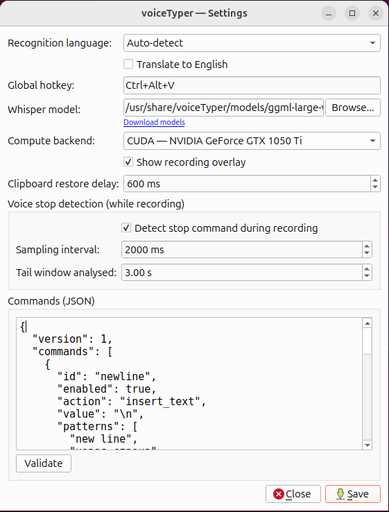

<p align="center">
  
</p>

<h1 align="center">voiceTyper</h1>

Local, privacy-friendly **voice typing** for the desktop. Put the cursor in any
text field, press a global hotkey, speak, and the recognized text is pasted into
the active field. Speech recognition runs **entirely on your machine** via
[whisper.cpp](https://github.com/ggerganov/whisper.cpp) — no Python, no cloud, no
account, no telemetry. Your audio never leaves the device.

- **Stack:** C++20 · Qt 6 · CMake · whisper.cpp `v1.8.6` (bundled, statically linked)
- **Compute:** CPU, **Vulkan**, **CUDA**, or **Metal** — picked at runtime from one binary
- **Platforms:** Ubuntu/Linux (X11; Wayland via a GNOME shortcut), Windows, and
  macOS (see [Platform notes](#platform-notes) — paste keystroke needs
  Accessibility permission).

<p align="center">
  
  <br>
  <em>The Settings window — recognition language, global hotkey, Whisper model, compute backend, voice-stop tuning, and the live commands editor.</em>
</p>

---

## Features

- 🎙️ **Push-to-talk dictation anywhere.** A single global hotkey starts/stops
  recording and types into whatever field has focus — editors, browsers, chat,
  terminals.
- 🔒 **100% offline & private.** Transcription is local via whisper.cpp. Nothing
  is uploaded; there are no API keys or network calls for recognition.
- ⚡ **GPU acceleration with runtime backend selection.** The same build ships
  CPU + (where the host toolchain allowed) **Vulkan** and **CUDA**. The app
  enumerates the *live* devices on the machine and lets you pick one in Settings;
  it auto-falls back to CPU when a GPU backend isn't usable. See
  [GPU acceleration](#gpu-acceleration).
- 🗣️ **Voice commands, fully config-driven.** Spoken phrases become actions —
  "new line" → newline, "tab" → a tab, etc. Patterns live in an editable
  `commands.json`; nothing is hard-coded. See [Voice commands](#voice-commands).
- 🛑 **Stop by voice, mid-recording.** Say a stop word (default **"stop"**) and
  recording ends immediately — a lightweight detection pass runs *while* you
  speak, not just at the end. The stop word is stripped from the result.
- 🌍 **Multilingual.** 16 recognition languages plus auto-detect, with an
  optional **translate-to-English** mode (Whisper's built-in translation).
- 📋 **Clipboard-safe paste.** The app saves your current clipboard, sets the
  recognized text, synthesizes the paste keystroke, then restores your previous
  clipboard a moment later — your copy buffer is left as it was.
- 🪟 **Lives in the tray.** No main window; a tray icon shows idle/recording
  state, with menu entries to toggle dictation, open Settings, and quit. An
  optional on-screen overlay shows a timer + live input-level meter while recording.
- 🧩 **In-app model management.** Settings links straight to model downloads and
  lets you browse to any `ggml-*.bin` / `.gguf` file; the app also auto-detects a
  model sitting next to the binary or in `models/`.
- 📦 **Self-contained installers.** Prebuilt Linux `.deb` packages (CPU / Vulkan /
  CUDA variants, Qt bundled) and a Windows setup `.exe` (Qt + MSVC runtime + GPU
  DLLs bundled). See [Install](#install-prebuilt-packages).
- 🪟➕🐧 **Single-instance IPC.** A second launch hands off to the running app —
  `voiceTyper --toggle` toggles dictation, which is how the global hotkey is
  wired up on Wayland (via a GNOME custom shortcut).

---

## How it works

1. You place the cursor in any text field.
2. You press the global hotkey (default **Ctrl+Alt+V**).
3. Recording starts; a small overlay appears in the corner with a timer + level meter.
4. You speak.
5. You stop by pressing the hotkey again **or** by saying a stop word (default **"stop"**).
6. The audio is transcribed locally by whisper.cpp (on CPU or your selected GPU).
7. Voice **commands** (e.g. "new line" → newline) are applied to the text.
8. The result is placed on the clipboard, the paste shortcut is synthesized
   (`Ctrl+V` / `Cmd+V`), and your previous clipboard is restored shortly after.

---

## GPU acceleration

whisper.cpp's GPU backends are compiled into voiceTyper, and the **active device
is chosen at runtime** — you don't need a separate build per machine (with one
caveat for CUDA packaging, below).

- **How selection works.** At startup the app enumerates every live compute
  device (`ComputeBackends`): CPU is always present; a **Vulkan**, **CUDA**, or
  **Metal** entry appears only when *both* that backend was built in *and* a
  matching GPU/driver is detected now. Pick one under **Settings → Compute
  backend**.
- **Auto mode (default).** With no explicit choice the app prefers the first GPU
  and falls back to CPU. If a selected GPU backend turns out to be unavailable at
  runtime, it falls back to CPU rather than failing.
- **What to install on the client.**
  - *Vulkan:* a Vulkan driver (e.g. `mesa-vulkan-drivers` or the vendor driver).
    No GPU SDK or vendor compute toolkit needed — attractive for zero-install GPU
    speedups across vendors.
  - *CUDA:* the NVIDIA driver (`libcuda.so.1`). The CUDA `.deb`/installer bundles
    the CUDA runtime libraries, so the toolkit itself is **not** required on the
    target.
  - *Metal (macOS):* nothing extra — it's part of the OS. whisper.cpp also picks
    up Accelerate/BLAS on Apple automatically; both are compiled in and detected
    with no configure flags.
- **Build-host control.** Vulkan and CUDA auto-detect at configure time and can
  be forced off with `-DVOICETYPER_WITH_VULKAN=OFF` / `-DVOICETYPER_WITH_CUDA=OFF`;
  Metal follows whisper.cpp's own Apple default (`GGML_METAL`).

---

## Voice commands

Commands are **not hard-coded** — they live in `commands.json` (under your app
config dir; the bundled default is `config/commands.default.json`). Each command
maps a set of spoken **patterns** to an **action**. Edit and validate them
directly in **Settings → Commands (JSON)**.

```json
{
  "id": "newline",
  "enabled": true,
  "action": "insert_text",
  "value": "\n",
  "patterns": ["new line", "line break", "next line"],
  "match_mode": "normalized_phrase",
  "remove_command_from_output": true
}
```

- **Patterns are arbitrary** — to make "return" mean a newline, just add it to
  `patterns` (or replace the list entirely).
- `match_mode`: `normalized_phrase` (lowercased, whitespace-collapsed,
  punctuation-stripped phrase match — fully supported) or `regex`
  (QRegularExpression; applied after the phrase pass).
- `remove_command_from_output`: drop the spoken command from the final text.

**Defaults** include "new line" → newline, "stop" → stop recording, and "tab" → a tab.

### Actions
Implemented today: `insert_text`, `stop_recording`. Reserved (schema-compatible,
not yet active): `insert_symbol`, `delete_previous_word`, `submit`, `escape`,
`custom_hotkey`, `custom_text_transform`. Unknown actions are preserved on save,
not discarded.

### Stop-during-recording
`stop_recording` works **mid-recording**, not just after. The
`CommandDetectionLoop` periodically (default every **2 s**) runs a fast whisper
pass over the most recent audio tail (default **4 s**) and ends recording when a
stop phrase is heard. The stop phrase is removed from the final text, and audio
after it is dropped. Tunable (or disabled) under **Settings → Voice stop detection**.

---

## Settings

Open **Settings** from the tray menu. Everything persists via `QSettings`.

| Setting | Default | Notes |
|---|---|---|
| Recognition language | Auto-detect | or pick one of 16 languages |
| Translate to English | off | Whisper's built-in translation |
| Global hotkey | `Ctrl+Alt+V` | single chord |
| Whisper model | auto-detected | path to `ggml-*.bin`; **Browse…** + **Download models** link |
| Compute backend | Auto (prefer GPU) | CPU / Vulkan / CUDA as available |
| Show recording overlay | on | timer + level meter |
| Clipboard restore delay | 600 ms | wait before restoring the old clipboard |
| Detect stop command while recording | on | the live stop-word loop |
| Sampling interval | 2000 ms | how often the loop checks |
| Tail window analysed | 4.0 s | length of audio the loop transcribes |
| Commands (JSON) | bundled defaults | editable, with a **Validate** button |

---

## Install (prebuilt packages)

### Ubuntu / Debian (`.deb`)

Three variants are produced, one per compute backend; install **one at a time**
(they all provide `/usr/bin/voiceTyper` and conflict with each other). Qt 6 is
bundled inside the package, so no Qt install is required.

```bash
sudo apt install ./voiceTyper-cpu_0.1.0_amd64.deb      # CPU only
sudo apt install ./voiceTyper-vulkan_0.1.0_amd64.deb   # CPU + Vulkan  (needs a Vulkan driver)
sudo apt install ./voiceTyper-cuda_0.1.0_amd64.deb     # CPU + CUDA    (needs the NVIDIA driver)
```

On install, the package downloads a default model (`ggml-large-v3-q5_0.bin`,
~1.1 GB) into its private models dir, so the app works out of the box. The model
is removed on purge.

> **Why three packages?** whisper.cpp's GPU backends link into the binary, and
> CUDA in particular becomes a hard launch dependency. A single "universal" build
> would refuse to start on machines without the CUDA runtime — even for CPU/Vulkan
> users — so the variants stay independently runnable.

### Windows (`setup.exe`)

Four installers are produced, one per compute backend — pick the one matching
your hardware:

| Installer | Backends |
|---|---|
| `voiceTyper-<version>-cpu-setup.exe`    | CPU only |
| `voiceTyper-<version>-vulkan-setup.exe` | CPU + Vulkan  (needs a Vulkan driver) |
| `voiceTyper-<version>-cuda-setup.exe`   | CPU + CUDA    (needs an NVIDIA GPU) |
| `voiceTyper-<version>-all-setup.exe`    | CPU + Vulkan + CUDA (universal) |

Each bundles the full self-contained runtime — the executable, all Qt DLLs and
plugins, the MSVC runtime, and the backend DLLs it actually uses (CUDA cuBLAS /
Vulkan loader) — and creates Start Menu / optional Desktop shortcuts. No Visual
C++ Redistributable install needed. The variants share one install dir, so
installing one replaces another (pick a single build). The `all` installer ships
every backend's runtime DLLs, so — unlike the Linux packages — it starts even
where CUDA isn't installed and falls back to the best available backend at
runtime. Unless the installer was built with the model bundled in, download a
model on first run (Settings → **Download models**).

---

## Build from source

### Prerequisites

**Common**
- CMake ≥ 3.21
- A C++20 compiler (GCC 11+, Clang 14+, or MSVC 2022)
- Qt 6 with the **Core, Gui, Widgets, Multimedia, Network** modules
- Git + network on the first build (to fetch whisper.cpp), unless you provide a
  local checkout (see [whisper.cpp dependency](#whispercpp-dependency))

**Ubuntu / Linux (X11)** — the global hotkey and paste-keystroke synthesis use X11:
```bash
sudo apt install build-essential cmake git \
    libx11-dev libxtst-dev libxcb1-dev \
    libasound2-dev libpulse-dev          # Qt Multimedia audio capture
# Optional GPU (auto-detected at configure time):
#   Vulkan: libvulkan-dev glslc   (glslang-tools / shaderc)
#   CUDA:   the CUDA toolkit (nvcc)
```
If you installed Qt via the online installer (e.g. `~/Qt/6.11.1/gcc_64`), the
build scripts auto-detect it, or pass `-DCMAKE_PREFIX_PATH`. A distro Qt6
(`qt6-base-dev`, `qt6-multimedia-dev`) is found automatically.

**Windows**
- Visual Studio 2022 (Desktop C++) + Windows SDK, CMake, Qt 6 (MSVC kit). The
  hotkey/paste use the Win32 API directly — no extra system libraries.
- Optional GPU backends auto-detected: Vulkan SDK and/or the CUDA toolkit.

**macOS**
- Xcode Command Line Tools (`xcode-select --install`) for the AppleClang C++20
  toolchain. Qt 6 (Homebrew `qt` or the online installer, e.g.
  `~/Qt/6.11.0/macos`) with the Core/Gui/Widgets/Multimedia/Network modules.
- The hotkey/paste use Carbon and Quartz (`Carbon.framework`,
  `ApplicationServices.framework`) — both ship with the OS, no install needed.
- GPU: Metal + Accelerate are always available and auto-detected; no toolkit to
  install.
- The paste keystroke (Cmd+V synthesis) needs **Accessibility permission**,
  granted the first time it runs: System Settings → Privacy & Security →
  Accessibility.

### whisper.cpp dependency

By default the build **fetches whisper.cpp** (`v1.8.6`) via CMake `FetchContent`
and links it statically — nothing extra to install. Resolution order:

1. `-DWHISPER_CPP_SOURCE_DIR=/path/to/whisper.cpp` (your local checkout)
2. `third_party/whisper.cpp/` if you vendor it (e.g. as a git submodule)
3. FetchContent from GitHub (needs network at configure time)

To build **without** any ASR backend (UI/plumbing only, uses `NullAsrEngine`):
`-DVOICETYPER_WITH_WHISPER=OFF`.

### Get a speech model

whisper.cpp needs a GGML model file. Grab one with the helper script (or use the
in-app **Download models** link):

```bash
# Linux/macOS — default is small-q5_1 (~180 MB, multilingual)
scripts/download-model.sh
scripts/download-model.sh large-v3-turbo-q5_0   # best quality/speed (~570 MB)
```
```powershell
# Windows
./scripts/download-model.ps1
./scripts/download-model.ps1 large-v3-turbo-q5_0
```

Models land in `./models`. The app auto-detects a model next to the binary or in
`models/` (`ggml-*.bin`, `*.bin`, `*.gguf`), or you pick the file in
**Settings → Whisper model**. Size/quality guide: `small-q5_1` (~180 MB) ·
`medium-q5_0` (~540 MB) · `large-v3-turbo-q5_0` (~570 MB) · `large-v3-q5_0` (~1.1 GB).

### Build & run — Ubuntu

The convenience script auto-detects the Qt kit and GPU toolchains:

```bash
git clone <this-repo> voiceTyper && cd voiceTyper
scripts/build-linux.sh                 # add --qt ~/Qt/6.11.1/gcc_64 if needed
scripts/download-model.sh              # one-time model download
./build/voiceTyper
```

Or drive CMake directly:

```bash
cmake -S . -B build -DCMAKE_BUILD_TYPE=Release \
  -DCMAKE_PREFIX_PATH=$HOME/Qt/6.11.1/gcc_64   # omit if using distro Qt6
cmake --build build -j
```

The app starts in the system tray (no main window). Left-click the tray icon or
press the hotkey to start/stop dictation; right-click for the menu.

### Build & run — Windows

```powershell
git clone <this-repo> voiceTyper; cd voiceTyper
./scripts/build-windows.ps1            # MSVC + Ninja; deploys Qt + runtime DLLs
./scripts/download-model.ps1
./build/voiceTyper.exe
```

The script initializes the MSVC environment itself (no Developer prompt needed)
and runs `windeployqt` so the folder is self-contained. Add `-Installer`
(optionally `-IncludeModel`) to package the four backend setup `.exe`s (CPU /
Vulkan / CUDA / All) with Inno Setup.

### Build & run — macOS

```bash
git clone <this-repo> voiceTyper && cd voiceTyper
cmake -S . -B build -DCMAKE_BUILD_TYPE=Release \
  -DCMAKE_PREFIX_PATH=$HOME/Qt/6.11.0/macos   # omit if Qt is on your CMAKE_PREFIX_PATH already
cmake --build build -j
scripts/download-model.sh
./build/voiceTyper
```

There's no `.app` bundle or convenience script yet (see
[Roadmap](#roadmap--todo)) — this builds and runs a plain Mach-O binary, which
is enough for local development; global hotkeys and Metal GPU accel both work
unbundled. `SettingsStore::autodetectModelPath()` looks for a model next to the
binary first, so either copy `models/` into `build/` or point Settings at the
`models/` folder at the repo root (run from the repo root and it's found via
the `./models` fallback).

### Package Linux `.deb`s

```bash
scripts/build_deb.sh                   # builds cpu vulkan cuda
scripts/build_deb.sh cpu               # just one variant
QT_PREFIX=~/Qt/6.11.1/gcc_64 scripts/build_deb.sh
```

---

## First run

1. Open **Settings** from the tray menu.
2. Choose your **recognition language** (default: `Auto-detect`) — or pick a specific language.
3. Confirm/choose the **Whisper model** path (use **Download models** if you have none).
4. Pick a **compute backend** (Auto prefers a GPU when present).
5. Set your **global hotkey** (default `Ctrl+Alt+V`).
6. Review the **Commands (JSON)** editor; **Validate**, then **Save**.
7. Put your cursor in any editor and try it.

---

## Platform notes

### Wayland (Linux)
Native Wayland restricts global input by design, so `XGrabKey` hotkeys don't
reach the app. Workaround: bind a **GNOME custom shortcut** to
`voiceTyper --toggle`, which uses the single-instance IPC to start/stop the
running app. Keystroke paste (XTEST) reaches X11 and XWayland windows; into
**native-Wayland** windows synthetic input is restricted and the pasted text may
not land — for fully reliable paste, run an **X11 session** for now. A native
Wayland input backend (virtual-keyboard protocol / uinput) is a TODO.

### macOS
The architecture is cross-platform; macOS-specific pieces:
- **Paste keystroke** (`KeyboardPaster_mac.cpp`): Quartz `CGEvent` Cmd+V is
  implemented but needs **Accessibility permission**; surface a prompt in the UI.
- **Global hotkey** (`HotkeyService_mac.cpp`): implemented with Carbon
  `RegisterEventHotKey` + an application event handler for
  `kEventHotKeyPressed`. Unlike a `CGEventTap`, this is serviced by the
  WindowServer, so it needs no Accessibility permission and works from an
  unbundled binary too. Qt swaps Control/Meta on macOS by default, so a
  sequence captured in Settings (e.g. physical ⌘) round-trips correctly —
  see the mapping note at the top of the file.
- **GPU acceleration**: Metal + Accelerate (BLAS) are auto-detected and built
  in by whisper.cpp's own CMake defaults on Apple — no extra flags needed;
  `enumerateComputeDevices()`/`resolveBackend()` (`ComputeBackends.cpp`) are
  backend-agnostic and pick Metal up the same way they do Vulkan/CUDA.
- Audio capture, ASR, commands, clipboard, overlay, tray, and settings are
  already portable (Qt + whisper.cpp).

---

## Module architecture

```
AppController            end-to-end coordinator (the dictation pipeline)
├─ RecordingController   recording state machine
│   ├─ AudioRecorder         QAudioSource capture → 16 kHz mono float
│   └─ CommandDetectionLoop  live "stop word" detection while recording
├─ WhisperAsrEngine     whisper.cpp wrapper (IAsrEngine; NullAsrEngine fallback)
│   └─ ComputeBackends      enumerate/resolve CPU · Vulkan · CUDA · Metal devices
├─ CommandEngine        phrase/regex command matching + text reconstruction
├─ ClipboardPasteService save clipboard → set text → paste → restore
│   └─ KeyboardPaster        platform keystroke synth (X11 / Win / mac)
├─ HotkeyService        global hotkey (X11 XGrabKey / Win RegisterHotKey / mac Carbon RegisterEventHotKey)
├─ TextPostProcessor    NoOp now; HttpTextPostProcessor skeleton for future LLM cleanup
├─ SettingsStore        QSettings + commands.json
└─ UI: OverlayWindow · TrayController · SettingsWindow

main.cpp                single-instance QLocalServer IPC; `--toggle` drives the
                        running app (the Wayland global-hotkey path)
```

Source lives under `src/` grouped by module (`app/`, `audio/`, `asr/`, `commands/`,
`clipboard/`, `hotkey/`, `postprocess/`, `settings/`, `ui/`, `core/`).

---

## Roadmap / TODO

- macOS Accessibility-permission onboarding (prompt/instructions in the UI for
  the paste keystroke, which silently no-ops until granted).
- macOS `.app` bundle + `.dmg` packaging (icon, `Info.plist`, code signing,
  `macdeployqt`) — no installable package yet, only a plain dev build.
- Native **Wayland** input backend (virtual-keyboard protocol / uinput).
- `regex` reconstruction parity with the phrase pass (whitespace-inserting regex).
- Additional command actions (`submit`, `escape`, `delete_previous_word`, …).
- `HttpTextPostProcessor`: real HTTPS LLM cleanup with graceful fallback.
- In-app model auto-download (currently a links dialog + helper scripts).
